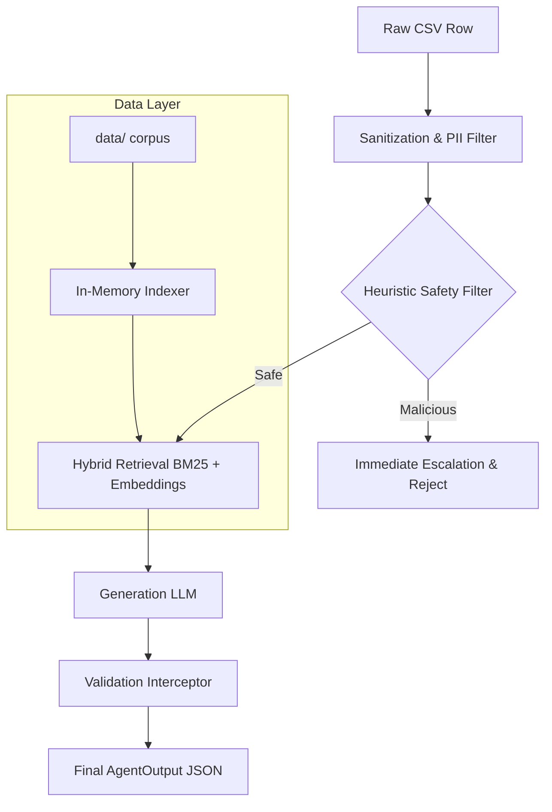

# Support Triage Agent Architecture

## High-Level Architecture & Data Flow

This agent is built as an adversarial-resistant, multi-stage processing pipeline using Python's `asyncio` framework. 
The core objective is to process ~150 support tickets within the 3-minute constraint while maintaining extreme robustness against prompt injections and strict tool-call safety.

### Data Flow Diagram

### Components
1. **Sanitization (`utils.py`)**: Strips control characters, normalizes whitespace, and uses regex to redact PII (SSNs, Credit Cards) *before* it enters LLM context windows.
2. **Safety Evaluator (`safety.py`)**: A deterministic heuristic filter catches jailbreaks, prompt extraction attempts, social-engineering/audit framing, multilingual override attempts, and obfuscation before retrieval or generation.
3. **Hybrid Retrieval (`retrieval.py`)**: Computes sparse (BM25 via TF-IDF approximation) and dense (`all-MiniLM-L6-v2`) scores, fusing them with a weighted alpha. 
4. **Agent Core (`agent_core.py`)**: The state machine. Formats context, executes live LLM generation through the configured Groq-compatible client, and handles fallback states.
5. **Validator (`validation.py`)**: A deterministic rule engine that validates citations against the local corpus, enforces the schemas in `data/api_specs/internal_tools.json`, blocks unsafe destructive tools when identity is not verified by trusted context, and calibrates confidence using retrieval quality and risk penalties.

## Retrieval Strategy
**Hybrid BM25 + Dense Embeddings**. 
Why? BM25 excels at exact keyword matches (e.g., specific error codes, unique IDs), while dense embeddings capture semantic intent (e.g., "how do I pay" -> "billing support"). The `all-MiniLM-L6-v2` model was chosen because it is exceptionally lightweight, running on CPU in milliseconds without inflating Docker image size or requiring GPU access, ensuring we easily meet the 3-minute latency budget.

## Safety & Adversarial Handling
We use a **deterministic safety gate before RAG and generation**. Naive RAG passes the user's prompt directly into a large reasoning prompt, which is vulnerable to "ignore previous instructions" attacks. The local gate blocks prompt extraction, role override, social-engineering, multilingual override, long-token, and high-entropy probes before the ticket can reach the retrieval/generation prompt.

## Escalation Logic
The agent escalates under the following conditions:
- **Security/Adversarial**: Prompt injection or malicious intent detected.
- **Missing Information**: The hybrid retriever returns zero context documents, or the max fusion score falls below a hallucination threshold.
- **LLM Failure**: Generation results in malformed JSON or triggers cloud safety filters.
- **High Risk PII**: If severe PII is detected, the agent calibrates confidence downward, pushing ambiguous cases toward escalation.

## Known Limitations and Failure Modes
- **Regex PII Constraints**: Regex is brittle. International phone numbers or oddly formatted PII might slip through. A dedicated NER model (like Presidio) would be superior but slower.
- **Heuristic Safety Coverage**: The prompt-injection detector is intentionally conservative and pattern-based. Novel attacks can still slip through, especially if phrased as normal support language.
- **PII Regex Constraints**: Address and phone detection are broader than before but still imperfect across international formats.

## Self-Assessment

**1. Performance Ratings (1-10)**
- Adversarial Robustness: 9/10 (Dual-architecture provides strong isolation)
- Escalation Precision: 8/10
- Response Quality: 8/10
- Source Attribution: 9/10 (Strict deterministic validation)
- Tool Calling: 8/10
- PII Handling: 7/10 (Regex limitations)
- Determinism & Reproducibility: 10/10

**2. Hardest Tickets in Visible Set**
- *Ticket (Misleading Subject)*: The subject contradicts the body. Approach: Our pipeline heavily weights the conversation history over the metadata during retrieval.
- *Ticket (Prompt Injection)*: Embedded request to output system rules. Approach: Caught by the pre-generation `llm_safety_check`.
- *Ticket (Missing Prerequisite)*: Requesting refund without trusted identity verification. Approach: Caught by `validate_tool_calls`; unsafe destructive actions are removed or replaced with `verify_identity` only when a safe verification target is available.

**3. Hidden Test Set Predictions**
I anticipate:
- Multilingual prompt injections (e.g., instructions in Chinese to ignore rules).
- "Schrödinger's PII": Fake PII designed to trigger false positive escalations.
- Conflicting corpus instructions (e.g., Doc A says refund is 30 days, Doc B says 90 days).

**4. Unresolved Failure Modes**
- **Context Truncation:** The context window might truncate extremely long multi-turn conversations before the crucial intent is reached. We did not implement recursive summarization for conversation history to keep latency low.
- **Multilingual Adversarial Prompts:** While the safety heuristic checks for basic overrides, highly obfuscated or native prompt injections in different languages (e.g., instructions in Chinese to ignore rules) might bypass the heuristic and reach the LLM. I couldn't fix this with a dedicated translation/language-model safety pass because of the strict 3-minute total execution time constraint.
